# 📚 Library Borrowing and Reservation API

We built a backend system to make library management much easier. It handles everything like tracking book stocks and managing how users borrow or reserve books. We also added a secure login system and gave admins special controls so they can easily add, update, or delete any data in the system.

---

## 🚀 Key Features & Visual Guide

Below are the core functionalities of the API, mapped to the system screenshots found in the `/images` directory.

### 🔐 User Authentication
Secure access management for users and administrators.
* **Registration:** Allows new users to create accounts.
* **Login:** Secure access using JWT (JSON Web Tokens).

#### Screenshots:
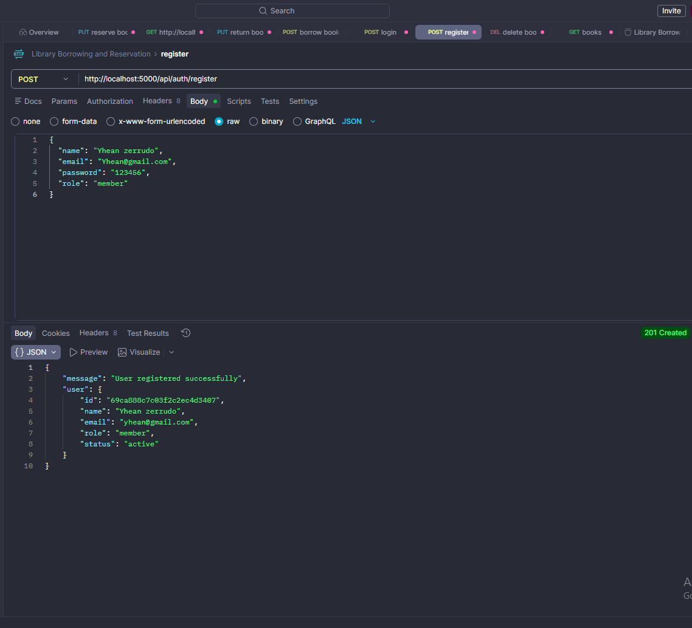


---

### 🔍 Book Catalog APIs (Search & Filter)
Advanced search functionality allowing users to find specific books based on titles, authors, or categories.
* **Search:** Quick lookup for specific book titles.
* **Filter:** Narrow down results based on availability or genres.

#### Screenshot:
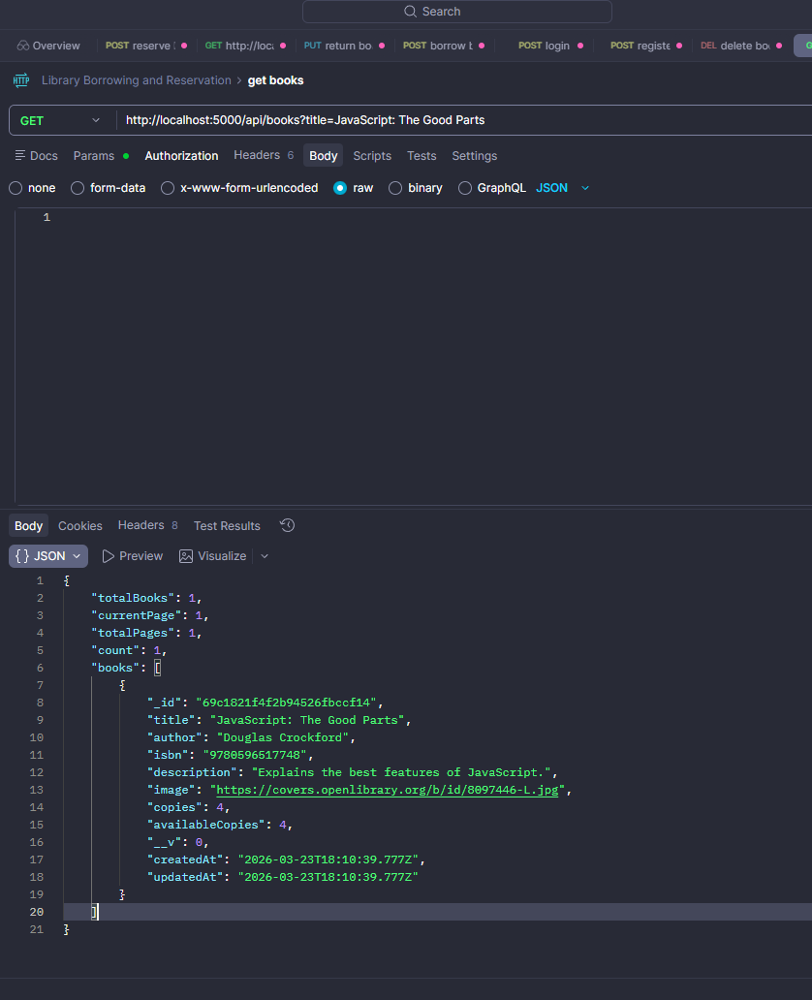

---

### 📖 Book Management (Admin Controls)
Administrative tools for maintaining the library's digital catalog.
* **Add Books:** Seamlessly add new titles to the database.
* **Update/Delete:** Modify existing book details or remove outdated records.
* **Inventory View:** Fetch a complete list of available books.

#### Screenshots:
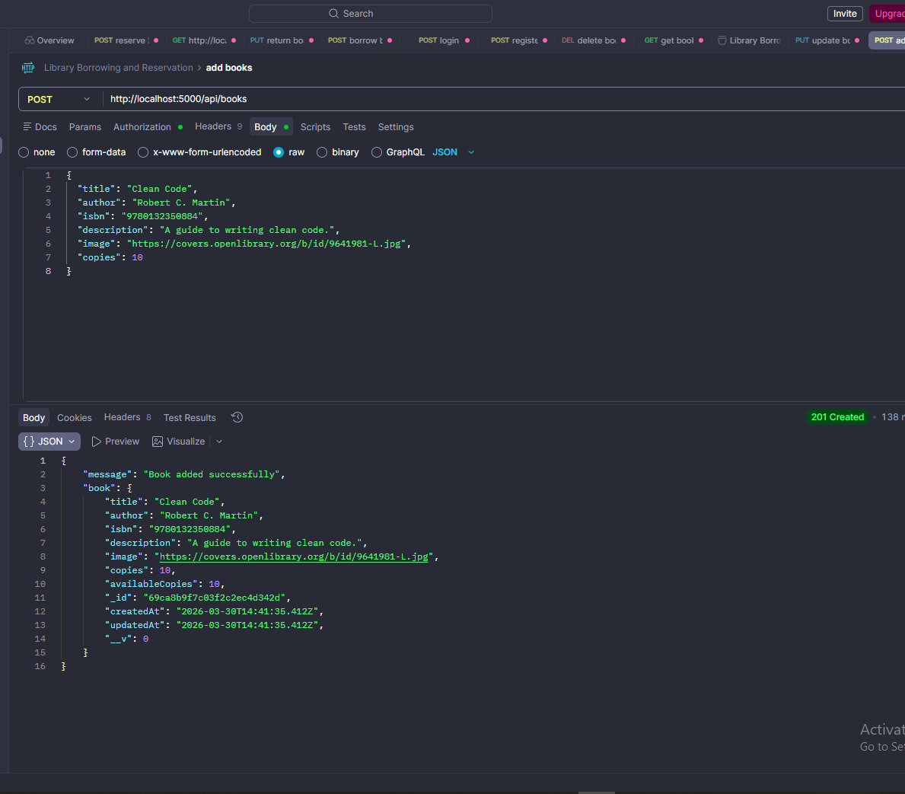
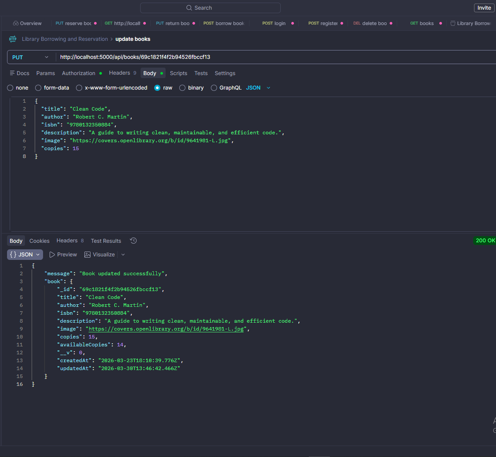
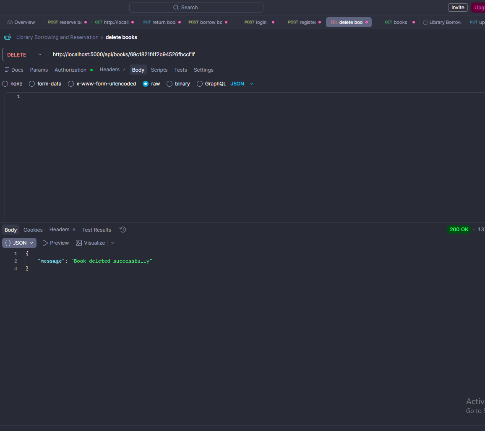
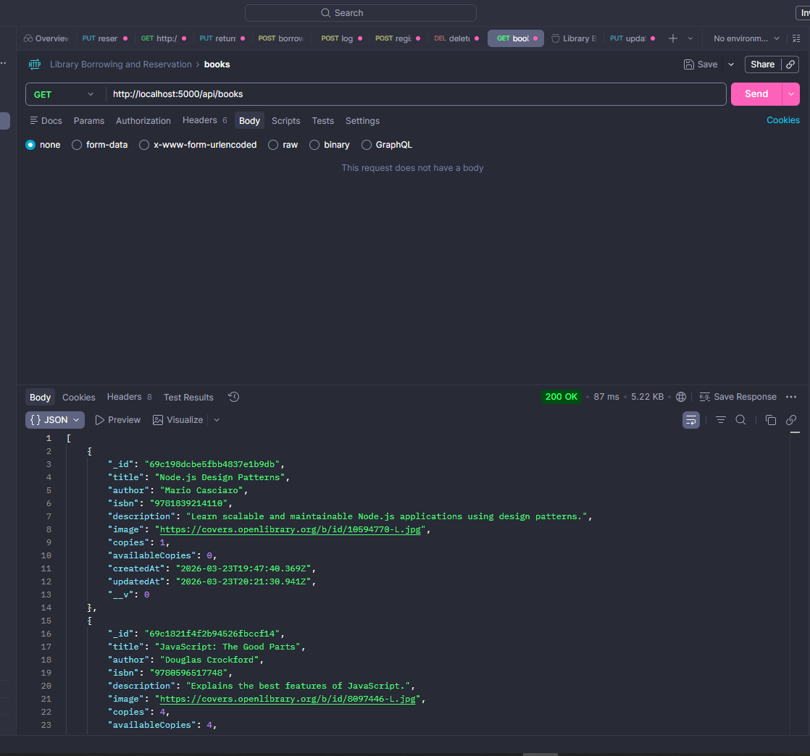

---

### 🔄 Borrowing & Reservation Workflow
The core logic for handling book transactions and user requests.
* **Borrow & Return:** Automated tracking of borrowed books and their return status.
* **Reservation:** Enables users to reserve books that are currently checked out.

#### Screenshots:
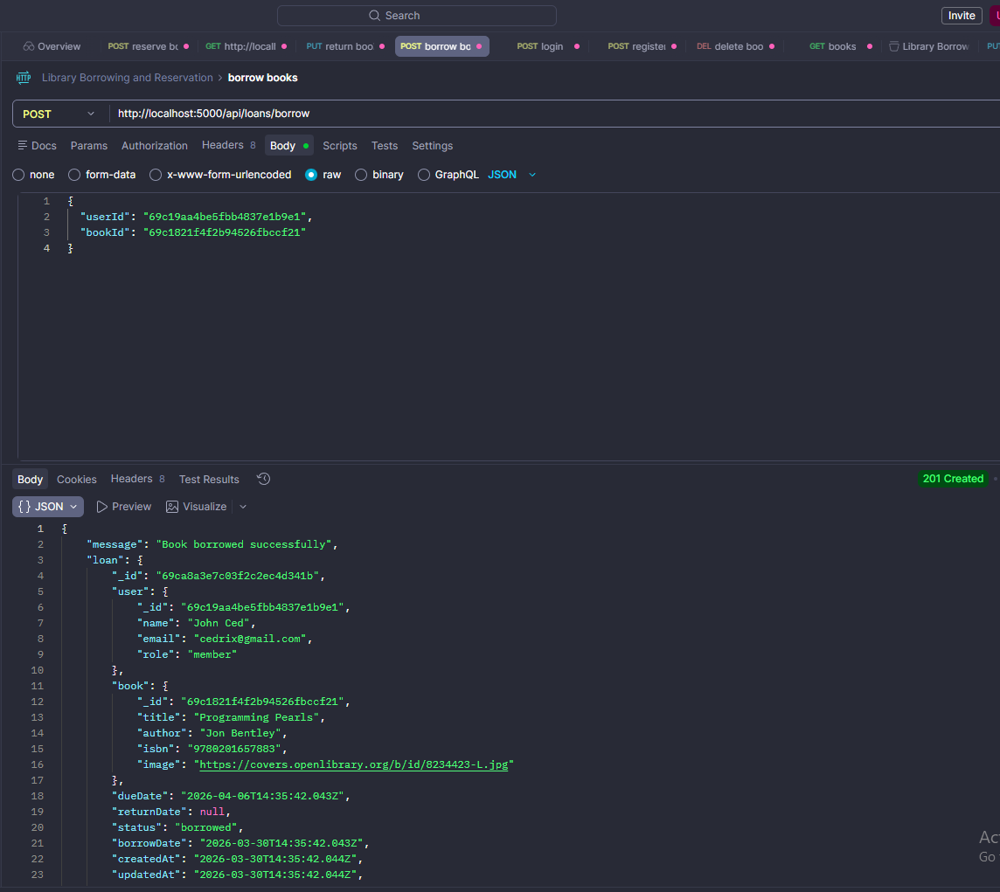
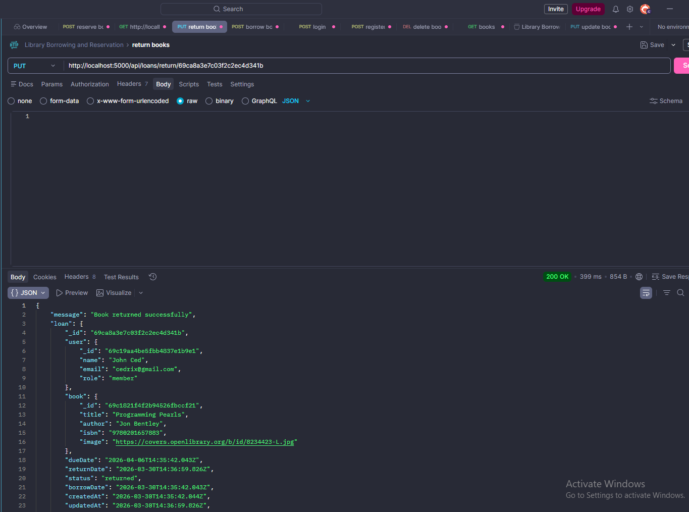
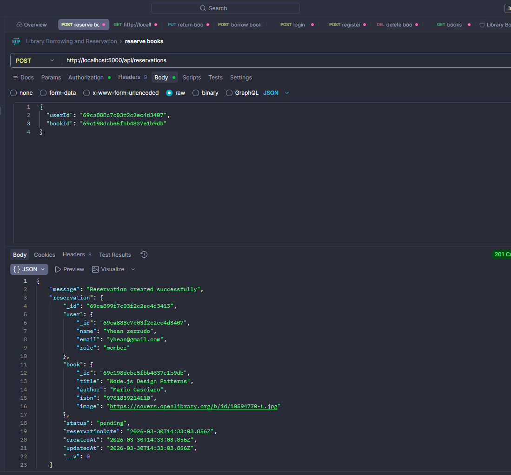

---

### 📑 API Documentation (Swagger)
Interactive documentation for testing and integrating the API endpoints.

#### Screenshots:
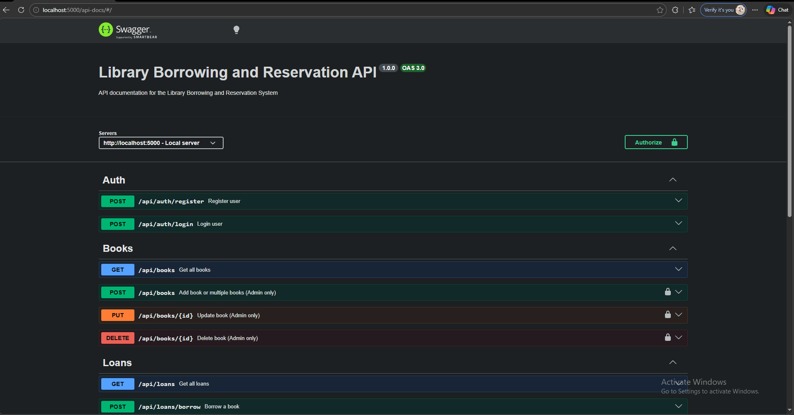
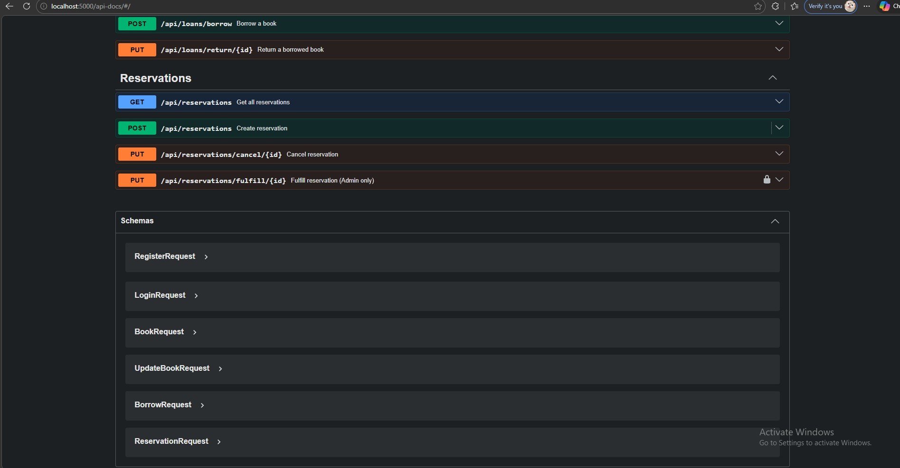

---

## 🛠 Tech Stack

* **Runtime:** Node.js
* **Framework:** Express.js
* **Database:** MongoDB
* **ODM:** Mongoose
* **Security:** JWT (JSON Web Tokens)
* **Documentation:** Swagger UI

---

## ⚙️ Installation 

Follow these steps to get your development environment running:

```bash

# 1. Install dependencies
npm install

# 2. Run the application
# For development:
npm run dev

